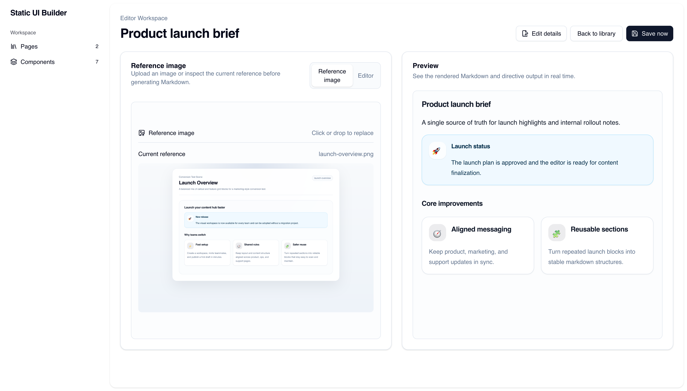
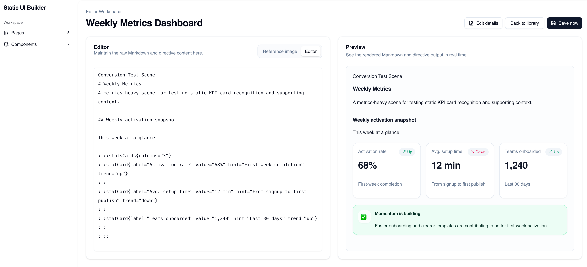
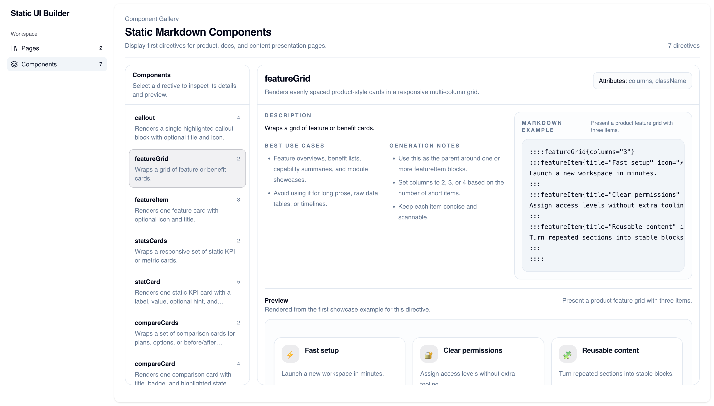

# Static UI Builder

Static UI Builder is a local-first Markdown workspace for authoring presentation-style pages with custom directive components.

It combines three workflows in one app:

- manage a small library of Markdown pages in browser storage
- edit and preview Markdown with validated static directives
- generate Markdown from reference images with Gemini, then refine the result in the editor

## Features

- Local page library with create, edit, delete, and autosave
- Live Markdown preview with custom display directives
- Image-to-Markdown generation through `/api/generate-markdown`
- Component gallery for inspecting supported directives, examples, and prompt guidance
- Strict directive validation so generated Markdown stays within the supported component set

## Product Screens


### Editor workspace

Upload a reference image on the left, switch into Markdown editing when needed, and keep the rendered preview on the right.



Editor it if doesn't look right, and the app will validate the Markdown against the supported directives and show errors if there are unsupported components or invalid directive usage. The directive syntax follows the [generic directives proposal](https://talk.commonmark.org/t/generic-directives-plugins-syntax/444).




### Components gallery

Inspect each supported static directive, review its prompt guidance, and compare the rendered preview against the Markdown example.



## Tech Stack

- React 19
- TypeScript
- Vite
- Tailwind CSS v4
- `remark-directive`
- Google Gemini via `@ai-sdk/google`

## Getting Started

1. Install dependencies:

```bash
pnpm install
```

2. Create a local env file:

```bash
cp .env.example .env
```

3. Set your Gemini API key in `.env`:

```bash
GOOGLE_GENERATIVE_AI_API_KEY=your_key_here
```

4. Start the dev server:

```bash
pnpm dev
```

The Vite dev server also mounts the local `/api/generate-markdown` endpoint used by the editor.

## Available Scripts

```bash
pnpm dev
pnpm build
pnpm lint
pnpm preview
```

## App Structure

### Pages

- `Pages`: library view for saved Markdown documents
- `Editor`: Markdown editing, image upload, image-based generation, and live preview
- `Components`: compact gallery for supported static directives

### Important Files

- [src/App.tsx](./src/App.tsx): app shell, routes, library page, editor page, and component gallery
- [src/components/markdown-with-directive/index.tsx](./src/components/markdown-with-directive/index.tsx): Markdown renderer and directive adapters
- [src/components/markdown-with-directive/components/markdown-with-directive-schema.ts](./src/components/markdown-with-directive/components/markdown-with-directive-schema.ts): directive registry, validation, and generation guide assembly
- [server/generate-markdown.ts](./server/generate-markdown.ts): image-to-Markdown API and validation flow
- [server/generate-markdown-system-prompt.ts](./server/generate-markdown-system-prompt.ts): system prompt builder for Gemini generation

## Supported Directive Components

Current display-first directives include:

- `withIconCardList`
- `withIconCardItem`
- `callout`
- `featureGrid`
- `featureItem`
- `statsCards`
- `statCard`
- `compareCards`
- `compareCard`

Each directive component lives in its own folder under:

`src/components/markdown-with-directive/components/`

The current convention is:

- `index.tsx`: render implementation
- `prompt.json`: prompt metadata, UI description, use cases, and few-shot examples

## Image-to-Markdown Generation

The generator accepts an uploaded image, calls Gemini, and returns:

- `title`
- `markdown`
- `rawText`
- optional `error`

If Gemini returns partially usable output that still fails directive validation, the API keeps the generated content and returns the validation error alongside it. This is intentional so prompt tuning can be based on the actual model output.

## Adding a New Directive Component

1. Create a new folder under `src/components/markdown-with-directive/components/`.
2. Add an `index.tsx` renderer and a colocated `prompt.json`.
3. Register the directive in [markdown-with-directive-schema.ts](./src/components/markdown-with-directive/components/markdown-with-directive-schema.ts).
4. Add the render adapter in [index.tsx](./src/components/markdown-with-directive/index.tsx).
5. If it should appear in the gallery, add it to the showcase list in [src/App.tsx](./src/App.tsx).

## Environment Variables

See [.env.example](./.env.example):

```bash
GOOGLE_GENERATIVE_AI_API_KEY=
GEMINI_MODEL=gemini-3-flash
```

## Notes

- Pages are stored in browser storage by default.
- Directive components are static and display-only. They should not communicate with each other or fetch data at runtime.
- Production builds currently emit a large chunk warning from Vite, but the app still builds successfully.
